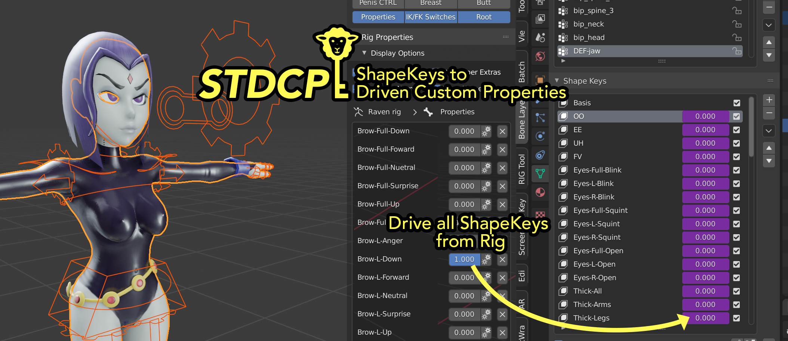
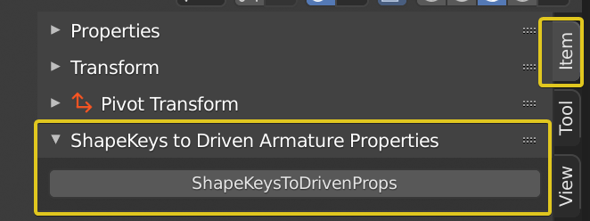

# ShapekeysToCustomProperties
Takes Shapekeys from a Mesh Object and adds Custom Properties with Drivers to an Armature that allow driving the ShapeKeys from the Rig

## Installing:  
**Download the ShapekeysToCustomProperties.py file.**  
In Blender go to **Edit > Preferences**  
Click the **Addons-Tab**  
Click the **Install... Button**  
**Browse to the .py file** and click the Install Button  
**Locate the addon** in the list of addons, it is located in the Rigging Category  
Just enter Shape in the filter if your list is very long  
**Check the Box** next to the addon's name to activate it   
Done

## Using:  
**Select your Mesh**, the one that has the ShapeKeys on it.  
**Select the Armature** that you want to drive the ShapeKeys.  
Go to **Pose Mode** and **select the Bone** that you want to hold the Custom Properties. Most people use either the Root Bone or a dedicated Properties Bone.  
Once you have selected your target Bone, **run the Operator** from 3D View > Properties Panel (aka N-Panel) > Item > ShapeKeys to Driven Armature Properties  
